# Sollu Database

The PostgreSQL schema is defined in `migrations/001_initial_schema.sql`, and its table and column documentation is defined in `migrations/002_schema_comments.sql`.

## Local Configuration

- Host: `localhost`
- Port: `5432`
- Database: `sollu`
- User: `myapp_user`

Run migrations with a PostgreSQL client from the repository root:

```bash
psql "$DATABASE_URL" -v ON_ERROR_STOP=1 -f database/migrations/001_initial_schema.sql
psql "$DATABASE_URL" -v ON_ERROR_STOP=1 -f database/migrations/002_schema_comments.sql
```

The database password must come from the server-side environment and must never be committed or exposed to web or mobile clients.

## Relationships

```mermaid
erDiagram
  USERS ||--o{ USER_ROLES : has
  ROLES ||--o{ USER_ROLES : assigned
  ROLES ||--o{ ROLE_PERMISSIONS : grants
  PERMISSIONS ||--o{ ROLE_PERMISSIONS : contains

  WORDS ||--|| WORD_INFORMATION : describes
  WORDS ||--o| PRONUNCIATIONS : has
  PRONUNCIATIONS ||--o| PRONUNCIATION_AUDIO : provides
  WORDS ||--o{ MEANINGS : defines
  MEANINGS ||--o{ MEANING_TAMIL : translates
  MEANINGS ||--o| MEANING_GRAMMAR : uses
  MEANING_GRAMMAR ||--o| VERB_FORMS : includes
  MEANING_GRAMMAR ||--o{ SENTENCE_PATTERNS : contains
  MEANING_GRAMMAR ||--o{ COMMON_PREPOSITIONS : uses
  MEANINGS ||--o{ MEANING_EXAMPLES : demonstrates
  MEANINGS ||--o{ SYNONYMS : relates
  MEANINGS ||--o{ ANTONYMS : contrasts

  WORDS ||--o{ WORD_IMAGES : illustrates
  WORDS ||--o{ WORD_FORMS : derives
  WORDS ||--o{ COLLOCATIONS : forms
  COLLOCATIONS ||--o{ COLLOCATION_EXAMPLES : demonstrates
  WORDS ||--o{ PHRASES : uses
  PHRASES ||--o{ PHRASE_EXAMPLES : demonstrates
  WORDS ||--o{ PHRASAL_VERBS : forms
  PHRASAL_VERBS ||--o{ PHRASAL_VERB_EXAMPLES : demonstrates
  WORDS ||--o{ IDIOMS : appears_in
  IDIOMS ||--o{ IDIOM_EXAMPLES : demonstrates
  WORDS ||--o| USAGE : explains
  USAGE ||--o{ USAGE_EXAMPLES : contains
  WORDS ||--o{ COMMON_MISTAKES : prevents
  WORDS ||--o{ CONVERSATION_EXAMPLES : demonstrates
  CONVERSATION_EXAMPLES ||--o{ CONVERSATION_LINES : contains
  WORDS ||--o{ COMMONLY_CONFUSED_WORDS : compares
  WORDS ||--o| MEMORY_TIPS : remembers

  WORDS ||--o{ WORD_CATEGORIES : categorized
  CATEGORIES ||--o{ WORD_CATEGORIES : contains
  USERS ||--o{ FAVORITES : saves
  WORDS ||--o{ FAVORITES : saved
  USERS ||--o{ LEARNING_PROGRESS : tracks
  WORDS ||--o{ LEARNING_PROGRESS : tracked
  USERS ||--o{ LEARNING_HISTORY : records
  WORDS ||--o{ LEARNING_HISTORY : reviewed

  QUIZZES ||--o{ QUIZ_QUESTIONS : contains
  QUIZ_QUESTIONS ||--o{ QUIZ_ANSWERS : offers
  WORDS ||--o{ QUIZ_QUESTIONS : tests
```



Clients access this data through the backend API. They must not connect directly to PostgreSQL.
